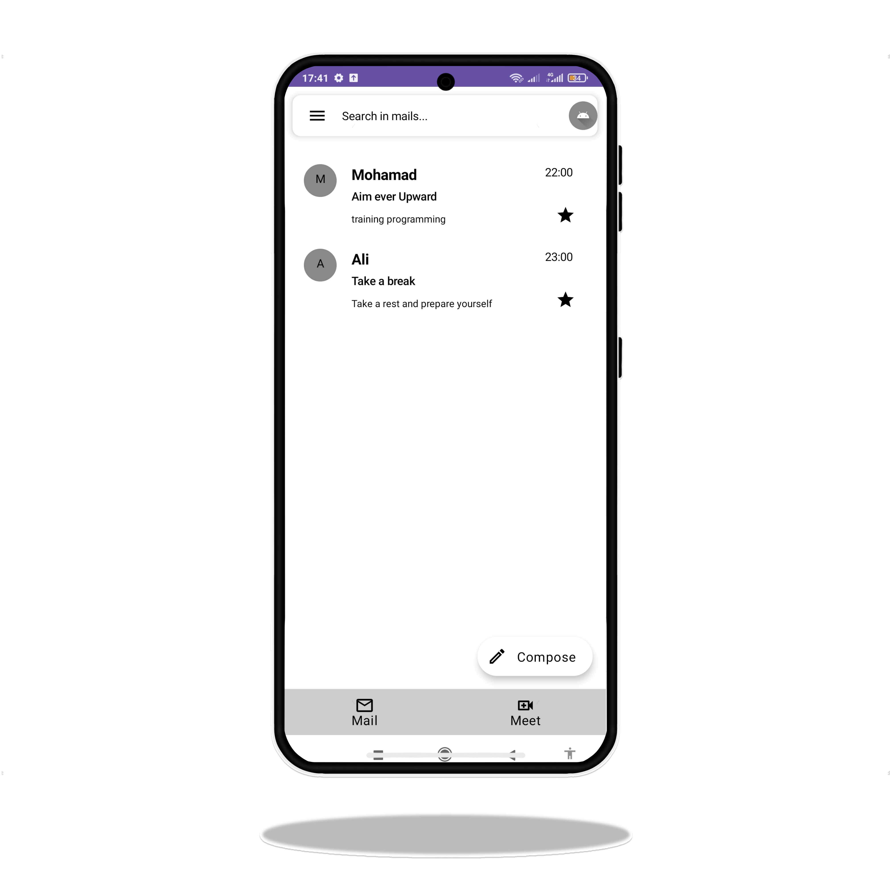

# Gmail Clone UI using Jetpack Compose

### App Demo

 

 
 

 

 

This repository contains a simple Android application that replicates the user interface of the Google Gmail app using
Jetpack Compose. The goal of this project is to demonstrate the power and simplicity of building modern UIs with Jetpack
Compose. Features:

* List of emails with sender names, subjects, and snippets.
* Navigation Drawer
* User profile

Before you begin, ensure you have the following requirements in place:

* Android Studio.
* Android device/emulator.

### Getting Started

Follow these steps to get the project up and running on your local machine:

Clone this repository:

bash

`https://github.com/mohamadp91/Google-Gmail-clone.git`

* Open Android Studio and select "Open an existing Android Studio project."

* Navigate to the cloned repository directory and select the gmail-clone-compose folder.

* Wait for the project to sync and build.

* Run the app on an emulator or physical device.

### Contributing

Contributions are welcome! If you find any issues or improvements, feel free to create a pull request or submit an
issue.

### Disclaimer

This project is for educational purposes only and is not affiliated with Google or the Gmail app in any way.